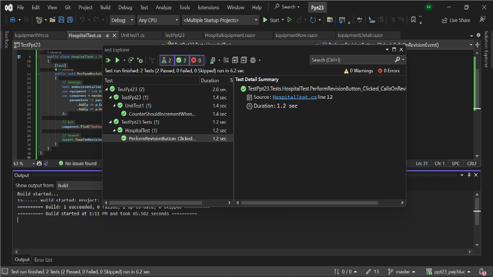

bUnit je testovacia knižnica špeciálne navrhnutá pre komponenty Blazor. Umožňuje písať komplexné integračné testy na zabezpečenie správnosti a funkčnosti komponentov Blazor.

## Začiatok
Nainštalujeme si balík bUnit NuGet a môžeme začať!

```powershell
dotnet add package bunit
```
alebo v Visual Studio's NuGet package manager.

Potom je potrebné vytvoriť nový projekt pre testy. Urobil som to kliknutím pravým tlačidlom myši na riešenie a výberom položky Add -> New Project. Potom som vybral xUnit Test Project (.NET Core) template. Pomenoval som projekt TestPpt23.

Potom som pridal odkaz na projekt, ktorý som chcel otestovať. Urobil som to kliknutím pravým tlačidlom myši na projekt TestPpt23 a výberom položky Add -> Reference. Potom som si vybral projekt, ktorý som chcel otestovať. V tomto prípade to boli Ppt23.Client a Ppt23.Shared.

Potom je potrebné do projektu pridať bUnit. Urobil som to kliknutím pravým tlačidlom myši na projekt TestPpt23 a výberom položky Manage NuGet Packages. Potom som vyhľadal bUnit a nainštaloval som ho.

## Písanie Testov
Pozrel som si návody na youtube a videl som tento https://youtu.be/1Cx6JMO_Wkk. Pozrel som si aj dokumentáciu bUnit https://bunit.dev/index.html

Potom som vytvoril nový súbor v projekte TestPpt23 s názvom CounterTest.cs. Robí to, že testuje komponent počítadla. Kontroluje, či je komponent counter vykreslený správne a či sa counter po kliknutí na tlačidlo zvýši.

## Spustenie Testov
Na spustenie testov som klikol na TestPpt23 v solution explorer a potom na Run tests. Tým sa otvorilo okno Test Explorer a spustil sa test. Test prešiel.

## Pisanie Hospital Testov  
Potom som vytvoril nový súbor v projekte TestPpt23 s názvom HospitalTest.cs. Overuje to, že kliknutie na tlačidlo "Perform Revision" v EquipmentRow.razor volá OnRevision udalosť.

1. Arrange: Inicializuje sa boolean premenná onRevisionCalled na sledovanie vyvolania udalosti OnRevision, vytvorí sa instancia EquipmentVm a komponent EquipmentRow sa vykreslí s instanciou vybavenia a spätným volaním udalosti OnRevision aktualizuje premennú onRevisionCalled.
2. Act: Klikne sa tlačidlo.
3. Assert: Premenná onRevisionCalled má hodnotu true. -> OnRevision udalosť bola zavolaná úspešne.

## Spustenie Hospital Testov
Na spustenie testov som klikol na TestPpt23 v solution explorer a potom na Run tests. Tým sa otvorilo okno Test Explorer a spustili testy. Testy boli úspešné.



## Záver

Na záver, bUnit je výkonná testovacia knižnica špeciálne navrhnutá pre komponenty Blazor. Pomocou bUnit môžeme jednoducho písať testy na zabezpečenie správnosti a funkčnosti Blazor aplikácií. Testy sú dobré v tom, že simulujú interakcie používateľov, renderujú komponenty a overujú ich správanie a výstup. Na knižnici bUnit som našiel len niekoľko návodov, preto som sa rozhodol urobiť jednoduchý test.

